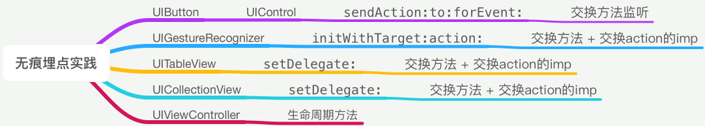

# 无痕埋点实践

参考了一些实现方案，自己选择了一种适合自己项目的，这里我将进行总结。

## 主体思路
主要思路就是要通过方法交换实现。<br>


拿Button举例，我们要确定一个可以路径来区分Button。
那么我这里使用的是：Target + Action + Tag
其实Target + Action 就可以确定一个唯一的Button。
Tag 是为了作为条件判断。例如:
```
- (void)buttonClick
{
    if(XXX)
    {
        //发送埋点1
    }
    else
    {
        //发送埋点2
    }
}
```
这样便可以使用Tag用于区分。

## 工具类
```
@implementation MethodSwizzingTool
+(void)swizzingForClass:(Class)cls originalSel:(SEL)originalSelector swizzingSel:(SEL)swizzingSelector
{
    Class class = cls;
    Method originalMethod = class_getInstanceMethod(class, originalSelector);
    Method  swizzingMethod = class_getInstanceMethod(class, swizzingSelector);
    
    BOOL addMethod = class_addMethod(class,
                                     originalSelector,
                                     method_getImplementation(swizzingMethod),
                                     method_getTypeEncoding(swizzingMethod));
    
    if (addMethod) {
        class_replaceMethod(class,
                            swizzingSelector,
                            method_getImplementation(originalMethod),
                            method_getTypeEncoding(originalMethod));
    }else{
        
        method_exchangeImplementations(originalMethod, swizzingMethod);
    }
}
@end
```

> 附加知识点:<br>
> > class_addMethod(Class,SEL,IMP,Type)<br>
> > Class：添加方法到哪一个类<br>
> > SEL：相当于方法的名称<br>
> > IMP：IMP指针指向方法的具体实现<br>
> > Type: 返回值类型<br>

## UIButton
UIButton继承于UIControl，每次的点击事件都会调用```sendAction:to:forEvent:```
核心代码如下：
```
@implementation UIControl (Analysis)

+ (void)load
{
    static dispatch_once_t onceToken;
    dispatch_once(&onceToken, ^{
        SEL originSelector = @selector(sendAction:to:forEvent:);
        SEL swizzingSelector = @selector(analysis_sendAction:to:forEvent:);
        
        [MethodSwizzingTool swizzingForClass:[self class] originalSel:originSelector swizzingSel:swizzingSelector];
    });
}

- (void)analysis_sendAction:(SEL)action to:(id)target forEvent:(UIEvent *)event
{
    [self analysis_sendAction:action to:target forEvent:event];
    
    //发送埋点
    ...
    ...
    ...
}
@end
```

## UITableView 
注释在代码中
```
@implementation UITableView (Analysis)

+ (void)load
{
    static dispatch_once_t onceToken;
    dispatch_once(&onceToken, ^{
        //交换setDelegate方法
        SEL originSelector = @selector(setDelegate:);
        SEL swizzingSelector = @selector(analysis_setDelegate:);
        [MethodSwizzingTool swizzingForClass:[self class] originalSel:originSelector swizzingSel:swizzingSelector];
    });
}


- (void)analysis_setDelegate:(id)delegate
{
    [self analysis_setDelegate:delegate];
    if (delegate) {
        SEL originSelector = @selector(tableView:didSelectRowAtIndexPath:);
        SEL swizzingSelector = @selector(analysis_tableView:didSelectRowAtIndexPath:);

        //重点
        //给Delegate添加的类 添加一个方法，方法的IMP指针是 self的analysis_tableView:didSelectRowAtIndexPath:
        //举个例子：Delegate是UIViewCobtroller，那么就是给UIViewController添加了一个 名字叫swizzingSelector的方法，方法的实现地址是self的analysis_tableView:didSelectRowAtIndexPath:
        BOOL addMethod = class_addMethod([delegate class],
                        swizzingSelector,
                        method_getImplementation(class_getInstanceMethod([self class], @selector(analysis_tableView:didSelectRowAtIndexPath:))),
                        nil);

        if (addMethod) {
            [MethodSwizzingTool swizzingForClass:[delegate class] originalSel:originSelector swizzingSel:swizzingSelector];
        }
    }

}

- (void)analysis_tableView:(UITableView *)tableView didSelectRowAtIndexPath:(NSIndexPath *)indexPath
{
    [self analysis_tableView:tableView didSelectRowAtIndexPath:indexPath];
    
    //发送埋点
}

@end
```

基本上其他的类似，这里不细讲。

## 维护json文件来发送埋点
如果在上述 ```//发送埋点```的地方，添加一个统一的方法调用，这样就可以发送埋点数据。
```
- (void)sendEventWithTarget:(NSString *)target action:(NSString *)action index:(NSUInteger)index
{
    if (target.length == 0 || action.length == 0) {
        return;
    }
    
    if (![[self.analysisDictonary objectForKey:target] isKindOfClass:[NSDictionary class]])
    {
        return;
    }
    
    if (![[[self.analysisDictonary objectForKey:target] objectForKey:action] isKindOfClass:[NSArray class]]) {
        return;
    }
    
    NSArray *eventArray = [[self.analysisDictonary objectForKey:target] objectForKey:action];
    
    if (index < eventArray.count && [eventArray[index] isKindOfClass:[NSDictionary class]]) {
        NSDictionary *event = eventArray[index];
        if ([[event objectForKey:@"eventID"] isKindOfClass:[NSString class]]) {
            NSString *eventID = [event objectForKey:@"eventID"];
            NSLog(@"===EventID %@===",eventID);
            //发送埋点

        }
    }
}
```
这个json数据文件格式可以不相同，只要保证能找到数据就好。<br>
进过如上的操作之后，那么其实之后的埋点添加就比较方便了，我们只要维护一份json文件就好，而且可以在点击的时候通过断点得知需要的信息，配置在json文件里面。

[Demo]()